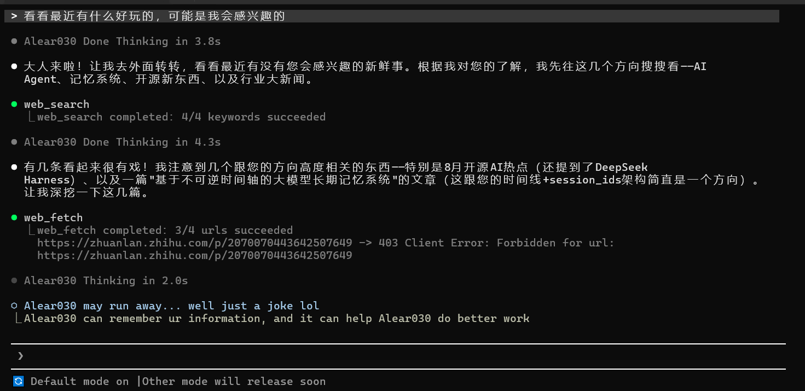
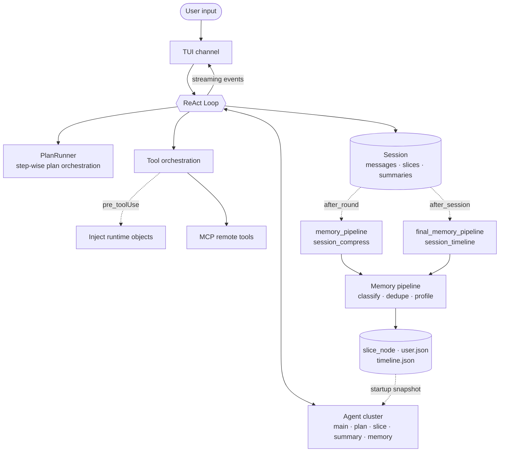
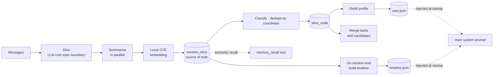

<div align="center">


# Alear030

A self-built agent harness with long-term memory

**What memory retrieves is not documents — it is the moments we lived through together**

[](https://www.python.org/)
[](LICENSE)
[](#what-this-is)
[](#what-this-is)

[Docs index](docs/index.en.md) · [Architecture](docs/ARCHITECTURE.en.md) · [Memory](docs/modules/memory.en.md) · [Configuration](docs/CONFIGURATION.en.md) · [Extending](docs/EXTENDING.en.md) · [Collaboration](COLLABORATION.en.md) · [CHANGELOG](CHANGELOG.md) *(Chinese)*

[中文](README.md) · **English**

</div>

---

## What This Is

Alear030 is not a "Python agent framework" — it is a complete agent harness. The model does the reasoning; tool orchestration, multi-agent routing, session lifecycle, event-driven hooks and cross-session memory recall are all things I wrote from scratch in this repository myself, without wrapping any existing framework.

Memory is where most of that effort went, but what I originally set out to build was not a harness with memory bolted on — it was **an agent that could grow on its own**, and memory is only the necessary foundation for that. That is why almost every classification scheme in the system refuses to be hard-coded: slice feature words, profile dimensions and task nodes all grow out of use instead of being a pre-written field table. This main line explains a lot of the strange-looking choices further down, including why the graph structure — the thing I researched longest — was never shipped in the end.

One thing I have to say as well: what memory does today implements only part of what I had in mind, and I am neither able nor willing to claim it is finished. Why it looks the way it does, and what is still missing, is written up in **[the design journey](docs/design/memory.en.md)**.

**Zero-Infra** — once the dependencies are installed, `python main.py` is the whole thing: nothing to spin up first, nothing to connect to. Model inference still goes to whatever API you configure, but embeddings are computed in-process with local GTE weights, and slices, profile and timeline are all JSON files on disk.

This is a tradeoff, not a claim of superiority. [Graphiti](https://help.getzep.com/graphiti/getting-started/quick-start) builds on a standalone graph database (Neo4j 5.26+ or FalkorDB 1.1.2+) and gets mature graph queries and production-grade operations in return; [Mem0](https://docs.mem0.ai/open-source/quickstart) needs no external service by default (local Qdrant under `/tmp/qdrant`) but [defaults to OpenAI when no embedder is configured](https://docs.mem0.ai/components/embedders/overview), trading a network hop for hosted embedding quality. This project pulls both back onto your machine, and pays for it: no graph capability, embedding quality bounded by a 195MB local model, no multi-tenancy, no horizontal scaling.

If you need multi-tenancy, shared team memory, or production operations, those projects fit better. This one fits the other end: one person, one machine, runs after install, data never leaves the box.

(Dependency details as of 2026-08; upstream may change — links go straight to the relevant docs pages so you can check.)

> **An experimental project I build and maintain on my own. APIs may change.**
> Chinese-first: system prompts, agent identities and memory prompts are all written in Chinese, and the embedding model is a Chinese GTE.
> Developed and tested on Windows only; Linux and macOS are unverified — nothing is known to block them, but nothing is guaranteed.
> Cross-session memory is **off by default** — `MEMORY_PIPELINE_ENABLED` in `config.py` defaults to `False`; set it to `True` before anything is sliced, stored or recalled.

What the memory system looks like today is in **[the memory documentation](docs/modules/memory.en.md)**.

---

## Demo

<div align="center">

</div>

---

## Features

- **A pure ReAct engine** — `Loop` knows nothing about plan orchestration; `main` and runtime-spawned subagents share the same implementation
- **Multi-agent cluster** — five resident agents whose identity, model tier and tool authorization are driven by YAML; subagents can be constructed at runtime per task
- **Session slicing + local embedding recall** — an LLM cuts topic boundaries, a local Chinese GTE model computes the vectors; no external vector database involved
- **Cross-session memory** — a background pipeline classifies slices, deduplicates them, distills a user profile and builds a cross-session timeline
- **Event-driven hooks** — four event points, synchronous or background, and adding a hook means dropping one `hook.py` into the right directory
- **Zero-boilerplate tool registration** — `@register_tool` plus `inspect.signature` generates the function-calling schema automatically
- **MCP client** — both stdio and Streamable HTTP; remote tools register into the tool table at runtime once a server connects
- **Textual TUI** — streams thinking, tool calls and replies, with one channel per agent

---

## Quick Start

```bash
git clone https://github.com/Alear030/Alear030.git
cd Alear030

pip install -e .   # direct dependencies are pinned, but there is no lockfile

cp .env.example .env
# Edit .env — you only need the three model tiers: MAX / MEDIUM / LOW_LEVEL.
# All three may point at the same provider, differing only in model_name.
# The models must support function calling (tools), or main and plan will not run.

python main.py
```

On the first run, the local embedding weights (~195 MB) download automatically from ModelScope into `local_model/`. It needs network access only the first time; after that it works offline. This is unrelated to `MEMORY_PIPELINE_ENABLED` — the prewarm runs before that switch is read, so the weights download even with the memory pipeline off.

To connect an MCP server, tune runtime constants, or see every available setting, read **[Configuration](docs/CONFIGURATION.en.md)**.

---

## Architecture

How a single user input flows through the system:



For the full directory tree, the startup and shutdown sequences and per-module responsibilities, see **[Architecture](docs/ARCHITECTURE.en.md)**.

---

## Memory System

This is where most of my effort went, and the main thing separating Alear030 from "ReAct plus tool calling" projects. I implemented the whole chain myself, with **no external vector database**.

What it retrieves is not documents but **episodes it actually lived through** — a stretch of conversation whose topic boundary was cut by an LLM, carrying a topic, keywords, a summary and a vector. The unit is not "a chunk of text" but "an episode with start and end round coordinates".



A few non-obvious parts:

- **The last slice is an open tail** — the pointer takes the last slice's start round and re-feeds everything after it each turn, so a new turn can merge into the same slice instead of sealing one per turn
- **Round numbers from the model are not trusted** — models routinely renumber the re-fed window as if it were a fresh conversation starting at 1; the batch is shifted back by `real window start - model's first start` rather than discarded on mismatch
- **Three-phase locking** — snapshot under lock, run the LLM and embedding outside it, then a short write back under lock, so a slow turn of slicing never blocks the user's next message from being persisted
- **Two-layer dedupe** — an optimistic lock-free pass skips the classification call entirely for slices already stored; a second pass inside the lock guarantees correctness under concurrency. The key is the `(session_id, start_round, end_round)` coordinate, not a content hash

> ⚠️ **It is off by default.** `MEMORY_PIPELINE_ENABLED` in `config.py` defaults to `False`, and it disables more than storage — the check sits before slicing, so slicing and summarization do not run either. Set it to `True` to get any of the above.

Full data flow, every artifact and its consumers, and an honest list of **known limitations**, are in **[the memory documentation](docs/modules/memory.en.md)**.

Why I shaped it this way is in **[the design journey](docs/design/memory.en.md)**.

---

## Core Design Decisions

### 1. A multi-agent cluster, not one agent calling functions

Five resident agents, each with its own identity and tool authorization, declared in `agent/agents.yaml`. They are not functions of `main` — they share a memory space but reason independently. `main` gets everything; `plan` gets basic/file_read/memory/subagent/web/skill/mcp; `memory` gets only `memory_tool`; `slice` and `summary` get nothing.

### 2. Session slicing + embedding recall, not RAG

Each round, an LLM cuts topic boundaries, a local GTE model computes embeddings, and recall is cosine similarity. This is not "searching documents" — it is recalling lived episodes. Settled slices then flow through a background pipeline that classifies, deduplicates, and distills a profile and a timeline.

### 3. Event-driven hook system

Auto-discovery → registration → triggering at multiple event points → synchronous or background execution → filtering by match conditions. Five hooks are registered today, covering tool argument injection, slicing and summarization, session compression, tail-slice handling and timeline generation. Extending means adding one `hook.py` under the relevant hook point.

### 4. Tool registration with automatic OpenAI schema generation

`@register_tool` plus `inspect.signature` generates the function-calling parameter schema, so a new tool needs no boilerplate. The function signature is the single source of truth for the contract the model sees; no parallel schema is maintained per tool.

### 5. Layered prompt composition

Nine blocks each register independently via `@register_prompt(order, condition, enabled)`; `build_prompt(agent)` sorts and filters them into the final system prompt. Adding a block means creating a directory with a `prompt.py` — no other block changes. Note that `session_recent`, `memory_prompt` and `timeline_prompt` are **startup snapshots**: later writes in the same process do not refresh them.

### 6. Module decoupling

`agent`, `session`, `tool`, `hook` and friends never import each other directly. They are wired together by `main.py` and interact through hook injection inside the loop. I did this to keep circular imports from appearing as the project grows, and to avoid scattering lazy imports through the codebase.

> Each decision in full — plus the story behind the directional reversal in the `command` tool's security gate — lives in **[Architecture](docs/ARCHITECTURE.en.md)**.

---

## Roadmap

- [ ] Deeper TUI work (thinking and tool-call widgets exist; the experience is still being pushed)
- [ ] First version of a todolist
- [ ] First version of slash commands
- [ ] First golden set for evaluation
- [ ] Tool-call tracing
- [ ] Other things I want to build 😊

---

## Tech Stack

Python ≥3.10 · openai · pyyaml · tiktoken · rich · textual · sentence-transformers · transformers · modelscope · mcp · json-repair · requests · beautifulsoup4 · numpy · python-dotenv · ddgs

---

## Security

It runs commands, reads and writes files, and accesses the network on your machine. The `command` gate is built to stop the model from slipping, not to sandbox an adversary, and `file_tool` is asymmetric — writes are confined to `workspace/`, reads are not. Worth a look before you run it: **[SECURITY.md](SECURITY.en.md)**.

---

## How It Was Built

The repository carries the working agreements and agent skills I use to build it (`CLAUDE.md`, `.cursor/rules/`, `.claude/skills/`). They are not an accessory — this project was written by me and the agents together, and those files record how we split the work.

The full division of labour and how it shifted across a few phases: **[COLLABORATION.md](COLLABORATION.en.md)**; what each of the ten skills is: **[skills catalog](.claude/skills/README.en.md)**.

---

## Contributing

One-person project. No PRs for now, but issues are welcome — bugs, questions, design discussions alike. See **[CONTRIBUTING.md](CONTRIBUTING.en.md)**.

---

## License

[MIT](LICENSE)
