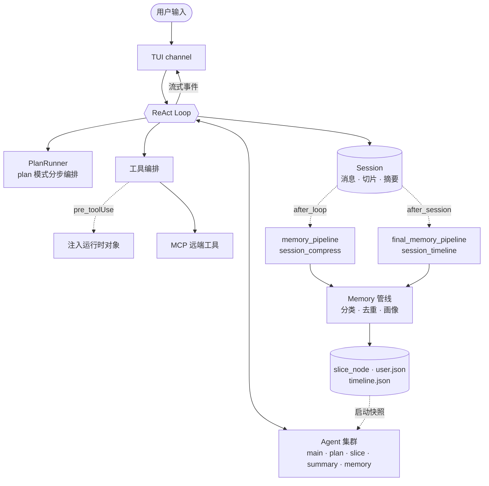
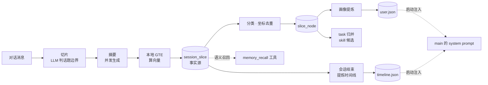

<div align="center">


# Alear030

自研长程记忆 Agent Harness

**记忆检索的不是资料，而是一起经历过的片段**

[](https://www.python.org/)
[](LICENSE)
[](#定位)
[](#定位)

[文档目录](docs/index.md) · [架构文档](docs/ARCHITECTURE.md) · [记忆系统](docs/modules/memory.md) · [研究](docs/index.md#研究) · [观察](docs/index.md#观察) · [复盘](docs/index.md#复盘) · [配置说明](docs/CONFIGURATION.md) · [扩展指南](docs/EXTENDING.md) · [协作说明](COLLABORATION.md) · [CHANGELOG](CHANGELOG.md)

**中文** · [English](README.en.md)

</div>

---

## 定位

Alear030 不是一个「Python Agent 框架」，是一套完整的 Agent 基础设施（Harness）。模型负责推理，工具编排、多 Agent 路由、会话生命周期、事件驱动 Hook、跨会话记忆召回全部由我在这个仓库里从零写出来，不包装任何现成框架。

其中记忆模块是投入最多的地方，但实际上我最初的目标并非是做一个带有记忆能力的 harness 框架，而是一个能自己生长的 agent，记忆只是实现它必需的底座。所以系统里几乎所有分类体系都不预先写死：切片特征词、画像维度、任务节点，都是随使用长出来的。这条主线解释了后面很多看起来奇怪的选择，包括研究了最久的图结构为什么最终没有落地。

同时也必须说一点：目前 memory 的设计只实现了我部分的想法，我不能也不想声称已经做完了。为什么是现在这个样子、还差的是什么，我写在 **[记忆的想法&构思](docs/design/memory.md)** 里了。

**Zero-Infra** —— 装完依赖 `python main.py` 就是完整形态，没有要先起的服务，也没有要连的库。模型推理仍走你自己配的 API，但嵌入用本地 GTE 权重在进程内算完，切片、画像、时间线都是磁盘上的 JSON 文件。

这是一条取舍，不是一条优势。同类方案各有各的换法：[Zep 的 Graphiti](https://help.getzep.com/graphiti/getting-started/quick-start) 依托 Neo4j 5.26+ 或 FalkorDB 1.1.2+ 这样的独立图数据库，换来成熟的图谱查询与生产级运维；[Mem0](https://docs.mem0.ai/open-source/quickstart) 开源版默认不需要外部服务（本地 Qdrant 落在 `/tmp/qdrant`），但[不配置 embedder 时默认走 OpenAI](https://docs.mem0.ai/components/embedders/overview)，换来开箱即用的托管嵌入质量。这个项目把两样都收回本机，代价也很实在：没有图谱能力、嵌入质量取决于那个 195MB 的本地权重、没有多租户与横向扩展。

如果你需要多租户、团队共享记忆或生产级运维，上面那些更合适。这个项目适用的是另一头：单人、单机、装完就跑、数据不出本地。

（依赖情况截至 2026-08，上游可能变化，链接直达对应文档页便于自行核对。）

> **我自己在做的实验性项目，单人维护，API 可能变动。**
> 中文优先：system prompt、agent 身份、memory prompt 均为中文，嵌入模型为中文 GTE。
> 仅在 Windows 上开发与实测；Linux / macOS 未验证，没有已知的硬性阻断，但不作保证。
> 跨会话记忆管线**默认关闭**：`config.py` 的 `MEMORY_PIPELINE_ENABLED` 默认 `False`，改成 `True` 才会切片、入库与召回。

记忆现在是什么样，写在 **[记忆系统文档](docs/modules/memory.md)**。

---

## 演示

<div align="center">

</div>

---

## 特性

- **纯 ReAct 引擎** —— `Loop` 对 plan 编排零感知，main 与运行时临时 subagent 共用同一份实现
- **Multi-Agent 集群** —— 5 个常驻 Agent，身份、模型等级与工具授权由 YAML 驱动；可在运行时按任务临时构造 subagent
- **会话切片 + 本地嵌入召回** —— LLM 切话题边界，本地中文 GTE 算向量，不依赖任何外部向量库
- **跨会话记忆** —— 后台管线做切片分类、去重、用户画像提炼与跨会话时间线
- **事件驱动 Hook** —— 5 个事件点，同步/后台两种模式，新增 Hook 只需在对应目录建一个 `hook.py`
- **工具零样板注册** —— `@tool.tool_register` + `inspect.signature` 自动生成 function-calling schema
- **MCP 客户端** —— stdio 与 Streamable HTTP 双传输，远端工具在 server 连上后运行时注册进工具表
- **Textual TUI** —— 流式渲染 thinking / tool call / 回复，按 agent 分 channel

---

## 快速开始

```bash
git clone https://github.com/Alear030/Alear030.git
cd Alear030

pip install -e .   # 直接依赖已钉死，但无锁文件，传递依赖可能漂移

cp .env.example .env
# 编辑 .env —— 只需填 MAX / MEDIUM / LOW_LEVEL 三级模型配置
# 三级可以指向同一服务商，仅 model_name 不同
# 模型必须支持 function calling（tools），否则 main 与 plan 跑不起来

python main.py
```

首次运行时，本地嵌入模型权重（约 195MB）会自动从 ModelScope 下载到 `local_model/`。需要联网，仅首次需要，之后离线可用。这一步与 `MEMORY_PIPELINE_ENABLED` 无关——预热在总闸判断之前执行，记忆管线关着也照样下载。

需要接 MCP server、调整运行常量或了解全部配置项，见 **[配置说明](docs/CONFIGURATION.md)**。

---

## 架构

一次用户输入的完整流转：



完整目录树、启动与退出流程、各模块职责见 **[架构文档](docs/ARCHITECTURE.md)**。

---

## 记忆系统

这是我投入最重的一块，也是 Alear030 和「ReAct + 工具调用」类项目的主要区别。整条链路我自己实现，**不依赖任何外部向量数据库**。

它检索的不是资料，是**它自己经历过的对话片段**——由 LLM 判断话题边界切出来的「一件事」，带主题、关键词、摘要和向量。所以最小单元不是「一段文本」，而是「一段有起止轮次坐标的经历」。



几个不显然的地方：

- **尾片是「未封口的临时尾巴」** —— 切片指针取最后一片的起始轮次，每轮把那之后的消息整体重喂，让新轮次有机会并进同一片，而不是每来一轮就封一片
- **不信任模型回显的轮次号** —— 模型常把重喂窗口当成从 1 开始的新对话重新编号，用「窗口真实起点 − 模型首片起点」的偏移整体平移回去，而不是校验不符就丢弃
- **三段式锁** —— 锁内读快照、锁外跑 LLM 与 embedding、锁内短写，慢计算不占锁，否则用户下一句输入要等整轮切片跑完才能落盘
- **两层去重** —— 锁外乐观去重省掉分类的模型调用，锁内二次去重保证并发正确性；去重键是 `(session_id, start_round, end_round)` 坐标而非内容哈希

> ⚠️ **默认是关闭的。** `config.py` 的 `MEMORY_PIPELINE_ENABLED` 默认 `False`，而且它关掉的不只是入库——判空在切片之前，所以切片摘要也一并不跑。改成 `True` 才能体验上述能力。

完整数据流、各产物的定义与消费者、以及**如实列出的已知限制**，见 **[记忆系统文档](docs/modules/memory.md)**。

我**为什么把它做成这样**，写在 **[记忆的想法&构思](docs/design/memory.md)**。

---

## 核心设计决策

### 1. Multi-Agent 集群，而非单 Agent 函数调用

5 个常驻 Agent 各有独立身份与工具授权，定义在 `agent/agents.yaml`。它们不是 main 的函数——共享记忆空间，独立推理。main 全开，plan 拿到 basic/file_read/memory/subagent/web/skill/mcp，memory 只开 memory_tool，slice 与 summary 全关。

### 2. 会话切片 + 嵌入召回，而非 RAG

每轮对话由 LLM 切话题边界 → 本地 GTE 算嵌入 → 余弦相似度搜索。不是「搜文档」，是「唤起经历」。定型切片再经后台管线分类、去重、提炼画像与时间线。

### 3. 事件驱动 Hook 系统

自动发现 → 注册 → 多事件点触发 → 同步或后台执行 → match 条件过滤。当前注册 7 个 Hook，覆盖 attachment 投递的生产与消费两端、工具入参注入、切片摘要、session 压缩、尾片处理与时间线生成。扩展只需在对应 hook point 下新建 `hook.py`。

### 4. 工具注册 + OpenAI Schema 自动生成

`@tool.tool_register` + `inspect.signature` 自动生成 function-calling 参数 schema，新增工具零样板代码。函数签名是模型可见参数契约的唯一真相源，不为单个工具另维护平行 schema。

### 5. Prompt 分层组合

9 个分块各自用 `@prompt.register_prompt(order, condition, enabled, type, target)` 独立注册。`type` 决定它走哪条路：`static` 由 `build_prompt(agent)` 排序过滤后拼成 system prompt；`notification` 不进 system prompt，改由 `before_session` 钩子按 `target` 投成 attachment 随用户输入送达。

这条分流是缓存驱动的——system prompt 排在 tools schema 前面，所以会变的内容只要还在 system prompt 里，哪怕压到最末尾也仍在 12.7K 工具 schema 之前，它一变，后面整块工具 schema 就失去前缀缓存。新增分块建个目录写 `prompt.py` 即可，不改其他分块。注意 `session_recent` / `memory_prompt` / `timeline_prompt` 仍是**启动快照**，同进程后续写入不会自动刷新。

### 6. 模块解耦

agent、session、tool、hook 等模块彼此不直接引用，而是通过 `main.py` 装配链接、通过 hook 在 loop 中的注入交互。我这么做是为了避免后续扩展时产生循环引用，也避免在子文件里写懒引用那种不优雅的绕法。

> 每条的完整版本、以及 command 工具安全闸门那次方向性反转的来龙去脉，见 **[架构文档](docs/ARCHITECTURE.md#核心设计决策)**。

---

## 研究

我在设计Alear030的时候，同时也会对不同的方向进行研究，有的内容不足以让我新开一篇说明或者想法文档写下来或者我其实也没太搞明白的我就会开一些research标签的issue用来记录，然后开一篇research题材的文档留存下来。

举一个在eval前期搭建trace基架时观察usage发现的问题：**每次新开 session，第一轮请求的 prompt cache 命中率只有 14%。** 我之前倒是知道system_prompt不同部分的顺序不同，可能会存在模型注意力和cache缓存命中率的问题，所以初期已经做了一些拆分和排序，但是没想到真正开始观测数据的时候竟然会这样。

一开始我怀疑是 `timeline` / `memory_prompt` 这两个「启动快照」分块——它们排在时间戳前面，内容又会被后台管线持续改写。但拿两次真实的`timeline` / `memory_prompt`完全没有变化的  session 的 system prompt 做字节级 diff，**前 4333 个字符逐字节完全相同**，唯一差异是结尾那句时间戳。

把那次请求的 token 拆开算，账才对上：

| | token | 命中 |
|---|---|---|
| system prompt | 2586 | 2176 |
| **工具 schema** | **12709** | **0** |
| 合计 | 15295 | 2176（~14%） |

工具 schema 占了整个请求的 83%，全量 miss。而它自己的内容跨进程是逐字节稳定的（工具发现显式 `sorted()`，schema 由 `inspect.signature` 推导，不含任何运行时状态）——**它是被排在它前面的那句时间戳连累作废的**。

一句「当前系统时间是……」，作废掉后面 12709 个 token（额的钱包！！！！！！两个多月的对话算什么？！算我赞助模型厂商嘛！！！可恶啊！）。后来把这句时间戳整块挪出 system prompt，又补上两个配套的排序/拼接修复，命中率从 14% 提到了 99.3%——总算不用继续倒贴给厂商了。

这条排查里我还撤回过一个结论：曾经用 `tiktoken` 量出「共享前缀应该有 2579 token，但只命中 2176，缺口 400」，后来发现 tiktoken 和 provider 自己的分词器对中文的偏差能到 ±30%，方向还相反——**拿一把尺子的读数减另一把尺子的读数，差值没有意义**。那 400 token 是测量误差，不是缓存现象。撤回过程和残留的开放问题都留在文里。

完整排查过程见 **[LLM Cache 方向研究&现象观察](docs/research/llm-cache.md)**。

---

## 观察

除了研究自己项目里的问题，我平时也喜欢观察一些有意思的东西——尤其是**别人家的系统怎么解一个我也在解的问题**。这类内容不讲 Alear030 是怎么做的，所以单独开了一类观察文档放。

它有一条别的文档没有的约束：**没有「以代码为准」可以兜底**，被观察方的源码我看不到、而且它会自己改。所以每篇都要标观察日期，并给每条断言标注证据等级——一手（本机可复现）、二手（被观察系统自己的说法，不构成验证）、三手（推断）。

第一篇是拿自己造记忆系统的经验，去逆向另一个 AI 助手的记忆机制。它跨会话记住了我上个会话的结论，我好奇它把我记成了什么样，点开文件看到 frontmatter 的那一刻就基本明白了——**一堆带头信息的 Markdown、一个自动加载的索引、几条写在系统提示里的纪律，零基础设施**。这跟我给 `memory_storage` 做的是同一个赌法：拒绝向量库，赌表示和纪律比机器更重要。

有意思的是接下来找到的缺口。它的记忆之间有 `[[链接]]`，但**没有反向索引也没有触发器**——一条记忆被推翻时，引用它的地方不会有任何反应。而真正的污染主通道还不是链接，是那个**每次会话无条件注入的索引**：索引行为了有召回价值塞满了实质结论，却是全系统最少被复核的一层。观察当天就抓到了现场——索引里有一条断言某篇文档已经落盘，而那个文件在磁盘上并不存在。

还有一条我猜错两次才对的：它的记忆桶不按项目分，**按工作目录分**。同一个仓库开了 git worktree，记忆就裂成互不可见的两半。

完整观察见 **[ZCode 的记忆系统观察](docs/observations/zcode-memory.md)**。文里给出了我用的审计三问——分层模型、生成路径、纠正传播——问完任何一套记忆系统，它的上下文预算、记东西的口味、烂掉的方式都会露出来。

## 复盘

还有一类内容既不讲这个项目现在是什么样，也不讲别人家的系统，而是讲**一次改动到底走过了什么路**：起点是什么、中途牵出了什么、最后落地的又是什么。这类信息不属于任何一个模块，写进谁的机制文档都不合适，但它恰恰是过后最难重新想起来的。

第一篇是 **[从 eval 走到架构](docs/retrospective/eval-to-architecture.md)**。起点是想给项目做 eval，为此得先有可信的过程数据，于是搭 trace；trace 给出的第一份真实数据掀开了 prompt 缓存的问题，而修它必须动 prompt 的归属——从这里开始，事情就不再是"修一个指标"了。

那条路上撞见的东西后来发现都有名字：**Big Ball of Mud**（边界从来没被强制执行过，所以往哪看都是违规）、**yak shaving**（追一个问题带出一片，永远修不完）、以及治它的那套办法——**爆破半径**当停止规则、**Boy Scout Rule**、**Strangler Fig**、**piecemeal growth**。中途我犯过一次典型错误：想把看见的问题一次全改掉，结果几十个文件同时半改，谁也验证不了谁。

最后那一下最值得记：修完测出首轮缓存命中率 14.2% → 99.3%，数字是真的，但收口时才发现 attachment 那条投递链路当时根本是断的——**验证了指标，不等于验证了机制**。

---

## Roadmap

- [ ] TUI 深化（thinking / toolcall 已有 widget，体验仍在推进）
- [ ] todolist 初版实现
- [ ] slash 命令初版实现
- [ ] eval 评测题集 golden set 初版建立
- [ ] toolcall trace 机制建立
- [ ] 其他我想做的东西 😊

---

## 技术栈

Python ≥3.10 · openai · pyyaml · tiktoken · rich · textual · sentence-transformers · transformers · modelscope · mcp · json-repair · requests · beautifulsoup4 · numpy · python-dotenv · ddgs

---

## 安全边界

它会在你的机器上执行命令、读写文件、访问网络。`command` 工具那层闸门的威胁模型是「防模型手滑」，不是沙箱；`file_tool` 的读写是不对称的（写受限于 `workspace/`，读可达任意绝对路径）。跑之前值得看一眼 **[安全说明](SECURITY.md)**。

---

## 怎么写出来的

仓库里放着我开发这个项目时用的协作规约与 agent 技能（`CLAUDE.md`、`.cursor/rules/`、`.claude/skills/`）。它们不是附属品——这个项目本身就是我和 agent 一起写出来的，那些规约记录了我们怎么分工。

完整的分工边界、这几个阶段是怎么变过来的，写在 **[协作说明](COLLABORATION.md)** 里；每个技能各自是什么，列在 **[技能目录](.claude/skills/README.md)**。

---

## 参与

单人维护，现阶段不接受 PR，但欢迎开 issue——bug、疑问、设计讨论都可以。见 **[参与方式](CONTRIBUTING.md)**。

---

## License

[MIT](LICENSE) — some vendored files carry their own upstream license; see [THIRD_PARTY_NOTICES.md](THIRD_PARTY_NOTICES.md).
