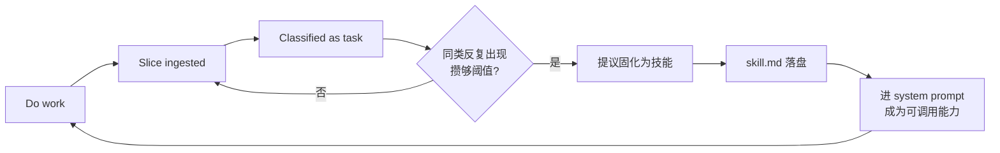

# Alear030 Memory System

[中文](memory.md) · **English**

← [Back to README](../../README.en.md) · [Docs index](../index.en.md)

This is the part of Alear030 that received the most investment, and the main difference from typical "ReAct + tool calling" projects. The full chain — topic-boundary slicing, embeddings, classification, deduplication, profile extraction, cross-session timeline generation, semantic recall — is implemented entirely in this repository, **with no external vector database**.

This document covers the mechanism. **Why it looks this way** is in [Memory ideas & design](../design/memory.md) *(Chinese)*; architecture overview in [Architecture](../ARCHITECTURE.en.md); configuration in [Configuration](../CONFIGURATION.en.md).

> **Every technical claim in this document has been checked against the code.** Unverified speculation is omitted; known rough edges are listed honestly in the final section.

---

## Table of Contents

- [Prerequisites: Off by Default](#prerequisites-off-by-default)
- [Design Stance](#design-stance)
- [Data-Flow Overview](#data-flow-overview)
- [Slices and Summaries](#slices-and-summaries)
- [Memory Pipeline](#memory-pipeline)
- [User Profile](#user-profile)
- [Cross-Session Timeline](#cross-session-timeline)
- [Self-Emergence: What This Pipeline Grows](#self-emergence-what-this-pipeline-grows)
- [Recall](#recall)
- [Local Embedding Model](#local-embedding-model)
- [In-Session Compression vs Memory](#in-session-compression-vs-memory)
- [How This Mechanism Grew](#how-this-mechanism-grew)
- [Known Limitations](#known-limitations)

---

## Prerequisites: Off by Default

In `config.py`, `MEMORY_PIPELINE_ENABLED = False`. **With the default after a clone, nothing described in this document runs.**

And it turns off more than "ingestion" — the guard in `hook/hooks/after_round/memory_pipeline/hook.py` sits **before** `session._session_slice()`:

```python
if memory is None or not memory.pipeline_enabled:
    return
# slicing + summary only happen below
session._session_slice()
session._session_summary()
```

So when disabled, slicing, summary, classification, profile, and timeline **do not run at all**. To try the full capability, set `MEMORY_PIPELINE_ENABLED` in `config.py` to `True`.

Know the cost: once enabled, each dialogue round triggers extra model calls (at least one for slicing, plus one per slice awaiting summary, plus classification and profile extraction).

---

## Design Stance

### Not "search documents" — "recall experience"

Common RAG chops sources into chunks, loads a vector store, and retrieves by question. Alear030 does not retrieve source documents; it retrieves **dialogue fragments it has lived through** — "one episode" cut by an LLM at topic boundaries, carrying topic, keywords, and summary.

So the atomic unit is not "a stretch of text", but "an experience with start/end round coordinates".

### Fact source vs derived storage

| Layer | File | Writer | Rebuildable? |
|---|---|---|---|
| **Fact source** | `session_messages` and `session_slice` inside `session/session_detail/{id}.json` | `Session` | No — this *is* the session |
| **Derived storage** | `slice_node` / `user` / `timeline` / `advanced_task_node` under `memory_storage/memory_storages/` | Memory pipeline | In theory, by re-running from the fact source |

**The derived layer never writes back to the fact source.** Classification results, profiles, and timelines only write under `memory_storage/`; they never mutate `session_detail`.

### No external vector database

Vectors are computed by a local Chinese GTE model, `struct.pack`ed, base64-encoded, and stored directly in the same JSON as the slice. Recall is a full linear scan plus cosine similarity. Scale limits are obvious; the trade-off is zero external dependencies and zero extra services.

---

## Data-Flow Overview

```text
user/assistant messages
  │ Session.session_message_insert() → session_messages[] in session_detail/{id}.json
  ▼
after_round · memory_pipeline (background thread, serial)
  │
  ├─1 session._session_slice()
  │    short-lock read snapshot → LLM + embedding off-lock → short-lock write
  │    produces session_slice[] entries:
  │      worthy_summary / session_id / time_stamp / start_round / end_round
  │      slice_embedding(b64) / slice_anchor{topic, key_words, summary_detail:""}
  │
  ├─2 session._session_summary()
  │    pick slices with worthy_summary=True and empty summary_detail → thread pool(5) concurrent summaries
  │    write back summary_detail, recompute embedding from topic+key_words+summary_detail
  │
  └─3 take session_slice[:-1] (exclude still-growing tail) where worthy_summary=True
       → Memory.slices_pipeline()
             ├ optimistic dedupe off-lock (save LLM calls)
             ├ slices_type_define() classify as task / user_info
             ├ second dedupe under lock, then write slice_node.json
             └ for slices actually newly ingested this pass:
                 'user_info' → user_info_extract() → user.json
                              → user_info_reform() → user_info.json template
                 'task'      → advanced_task_node_judge()
                              → (NO_MATCH) normal_task_node_judge()
                              → qualifying nodes become skill candidates, hinted to main agent via attachment

after_session · final_memory_pipeline
  └ run the same slices_pipeline on the now-sealed final tail slice

after_session · session_timeline
  └ Memory.session_timeline_extract() → append one entry to timeline.json

Consumers
  ├ prompt/prompts/memory_prompt/    reads user.json     → inject into main system prompt
  ├ prompt/prompts/timeline_prompt/  reads timeline.json → near/far layered inject
  └ tool/tools/memory_recall/        main agent calls actively; searches historical session_detail
```

One-line product map:

| Product | What it is | Producer | Consumer |
|---|---|---|---|
| `session_slice` | An experience with start/end rounds, topic/keywords/summary/vector | `_session_slice` + `_session_summary` | Memory pipeline, `memory_recall`, session compress |
| `slice_embedding` | Semantic vector for that slice (base64) | same as above | `memory_recall` |
| `slice_node` | Classified slice archive | `slices_pipeline` | task judging; upstream of profile extract |
| `user.json` | Full user profile | `user_info_extract` | `memory_prompt` block |
| `user_info.json` | Profile dimension template (no concrete facts) | `user_info_reform` | prompt template for the next extract |
| `timeline.json` | One cross-session event per session | `session_timeline_extract` | `timeline_prompt` block |

---

## Slices and Summaries

### Re-feed window: the tail is an "unsealed temporary tail"

Slicing is not "seal one slice per round". The pointer takes the **last slice's `start_round`**, and re-feeds every message from there to now into the slice model:

```python
slice_pointer = session_slice[-1]['start_round'] if session_slice else int(0)

unslice_messages = []
for msg in session_messages:
    if msg['message_round'] >= slice_pointer:
        unslice_messages.append(msg)
```

New rounds can thus **merge into the same slice** (the same episode continues) instead of being forcibly cut. The cost is that the last slice is recomputed every round — the "open slice" — and only becomes sealed when a later slice pushes it out of last place.

The window **keeps `tool_calls` and `tool_result`**: tool calls are real actions in the dialogue and key evidence for task-slice boundaries. Overlong tool_result bodies are truncated here (`_slice_window_payload`); otherwise a single 174KB tool output can push the slice window to tens of thousands of tokens.

### Anchor offset correction: do not trust model-echoed round numbers

This is the least obvious part of slicing. Models often treat the re-feed window **as a new dialogue renumbered from 1**, so `start_round` drifts from real rounds.

The fix is not "discard on mismatch" (that would almost never produce slices), but to take the real minimum round in the window as anchor and pull the whole batch back by the offset:

```python
window_start = min(msg['message_round'] for msg in unslice_messages)
offset = window_start - parsed_slices[0]['start_round']
for s in parsed_slices:
    s['start_round'] += offset
    s['end_round'] += offset
```

When the model returns absolute rounds correctly, `offset = 0` and nothing changes; when it renumbers, the offset maps back to real coordinates. **Both cases share one code path — no need to detect which kind of model output you got.**

After normalization, validate seamless coverage with no gaps/overlaps over the whole window; on failure, abandon the whole batch for this round (the next re-feed will bring the messages again) and write no dirty data.

### Three-phase lock

Both `_session_slice` and `_session_summary` follow: **short-lock read snapshot → LLM and embedding off-lock → short-lock write**.

Slow work must not hold the lock, or the next user input's `session_message_insert` waits for the whole slice round to finish before landing on disk — the UI freezes.

The cost is that on-disk data may have changed during the off-lock window, so:

- Slice write-back is **open-ended** — the sealed prefix must be written; if the disk already covers further past that prefix than this window, keep that continuation rather than discarding the batch because the tail changed
- Summary write-back **merges slice-by-slice on `(start_round, end_round)` coordinates**, never whole-table overwrite — otherwise off-lock slice edits would be wiped

### Two embedding computations: summary and vector

| When | Vector text | Notes |
|---|---|---|
| Slice stage | `topic + key_words` | Every new slice |
| After summary | `topic + key_words + summary_detail` | Overwrites the previous value |

Only slices with `worthy_summary=True` take the second step. The guard at the top of `_session_slice_summary`:

```python
if not session_slice['worthy_summary'] or session_slice['slice_anchor']['summary_detail']:
    return session_slice
```

**Empty summaries are not persisted**: if the model returns empty content, discard it together with the embedding computed from that empty summary, and retry next round. Otherwise a degraded vector would overwrite the usable one from the slice stage.

---

## Memory Pipeline

Entry point: `Memory.slices_pipeline()`. Incoming slices are already sealed by the hook (tail exclusion is at the hook layer; `memory_core` only receives slices ready to process).

### Two-layer deduplication

The dedupe key is the **`(session_id, start_round, end_round)` coordinate**, not a content hash — the coordinate *is* the slice's physical identity; the same session and round range can only be sliced once.

Two layers:

1. **Optimistic dedupe off-lock**: read `slice_node.json`; skip whole slices that already exist, **saving even the classification LLM call**. The read is unlocked and may be stale; that only affects "whether compute is saved"
2. **Second dedupe under lock**: correctness is guaranteed here, preventing two background hooks from both treating the same slice as new and double-writing

`actually_new` only records slices confirmed ingested under lock; later profile extraction is strictly based on it, so concurrent runs do not double-extract either.

### Three-state contract

Task judging uses two-level routing with three sentinel values:

| Return | Meaning | Next |
|---|---|---|
| `JUDGE_MERGED` | Merged into an existing node | Done |
| `JUDGE_NO_MATCH` | No match in the advanced node pool | Fall through to `normal_task_node_judge` |
| `JUDGE_FAILED` | The judge itself failed | Drop task handling for this slice; **do not fall through** |
| Other (node list) | Nodes qualifying for a skill | Collect as skill candidates |

`FAILED` and `NO_MATCH` must stay separate — falling through on failure only repeats the same error.

### Single agent, multiple tiers

On the memory side there is only one `memory_agent` instance. It adapts to sub-tasks via `_switch_prompt()` for the system prompt and `refresh_agent_level()` for model tier (classification uses `medium_level`; profile extract uses a stronger tier), rather than one Agent per sub-task.

Code comments state the motive: avoid configuration sprawl from too many subagents.

> Thread safety for this "in-place shared mutable state" depends on `HookManager`'s background pool `max_workers=1` — all background hooks run strictly serial. That is an **implicit convention**; `Memory` itself has no lock for it. See [Known Limitations](#known-limitations).

---

## User Profile

### Two files — do not confuse them

| File | Content | Writer |
|---|---|---|
| `memory_storage/memory_storages/user.json` | Profile **full payload**, with concrete facts and source coordinates | `user_info_extract` whole-file overwrite |
| `memory_config/memory_configs/user_info.json` | Profile **dimension template** — dimension names/descriptions/feature words only, no concrete facts | `user_info_reform` delta merge |

The template's role is to serve as dimension reference in the next extract prompt, so profile dimensions can self-emerge with use rather than hard-coding a fixed field set.

### "Full-payload" extraction

Unlike `slice_node`'s structured coordinate dedupe, profile "confirm / update / drop / merge dimensions" is semantic judgment and hard to express as fixed field rules. So the approach is: **have the model each time output the complete profile after merging "history + this pass"**, and Python overwrites the file wholesale.

Two checks before persist:

1. **Shape check** — must be a non-empty `list[dict]` and each dimension must carry `type_name`. Occasional model returns like `["系统错误"]` or a bare string must never land on disk, or they pollute `user.json` and the next boot's `memory_prompt` block hits `AttributeError`
2. **Source filter** — entries in `info_list` without `info_source` are dropped. No source means unreliable, matching "only extract grounded information"

What is checked is **shape and source**, not completeness. See [Known Limitations](#known-limitations).

---

## Cross-Session Timeline

At `after_session`, all worthy slices from this session are distilled into **one** timeline event and appended to `timeline.json`:

```json
{ "session_id": "...", "thread": ["...", "..."], "summary": "...", "keywords": ["..."], "source": "llm" }
```

### Three-level validation before fallback

Not "parse failed → fallback", but level-by-level:

1. Can JSON parse
2. Is the shape "an array containing exactly one object"
3. Are `thread` / `summary` / `keywords` each the right type and non-empty

Any level failing goes to `_fallback_timeline_entry()`: concatenate each slice's `summary_detail` into `thread`, take deduped keywords across slices, leave `summary` empty, and mark `source: "fallback"`.

**The `source` field makes fallback entries identifiable** — when re-running or evaluating distill quality later, you can tell model output from stitch-together fallback at a glance.

### Near/far layered rendering

Injection into the system prompt is not a full dump (many sessions would blow the budget). `prompt/prompts/timeline_prompt/` renders newest-first: recent entries keep full `thread`; older ones keep only `keywords + summary`, with a token budget cap.

> Note this layered rendering **lives only in the prompt layer**; `memory_core` has no matching implementation. Comments in `timeline_prompt/prompt.py` claiming parity with `memory_core` are leftover from an old path.

---

## Self-Emergence: What This Pipeline Grows

Earlier sections were about "remembering". But **remembering was never the goal** — the goal is an agent that can grow on its own; memory is only the necessary base (the origin of this line is in [Memory ideas & design](../design/memory.md) *(Chinese)*).

This section is that goal at the mechanism layer: **several tables in this pipeline are not fixed schemas; they grow with use.**

### Layer 1: classification feature words self-emerge

Slice classification does not rely on a fixed keyword table. Each type in `memory_type.json` carries a `type_feature` list; on each classification the model may propose new features, and `_update_memory_type` appends unseen ones:

```python
new_items = [f for f in type_feature if f not in existing]
merged = existing + new_items
entry['type_feature'] = type_feature if len(merged) > 10 else merged
```

Past 10 items is not unbounded growth: **the model's full merged result replaces the list wholesale** — the model has already decided merges per prompt rules. The feature library thus converges instead of growing forever.

### Layer 2: profile dimensions self-emerge

The user profile **has no preset field table**. `user_info.json` stores a dimension template (name / description / feature words, no concrete facts), and that template evolves via `user_info_reform` on each extract, in four cases:

| Case | Handling |
|---|---|
| Brand-new dimension | Add to template |
| Dimension description changed | Overwrite description |
| New feature words | Append, dedupe preserving order |
| **Two dimensions should merge** | Precisely delete absorbed old dimensions via `merged_from` |

The last case needs the most explanation. Merge **does not infer "absent this time → delete"**; the model must put an explicit `merged_from` list on the merged dimension naming which old dimension names it absorbed. Code comments give the reason:

> Precisely delete using merged_from on the merged dimension in rq_json (list of absorbed old type_name values); do not guess "absence means delete" (avoids deleting seed dimensions that have not yet accumulated info)

"Absence means delete" would kill **brand-new seed dimensions that have not yet accumulated any concrete info** — they were not mentioned this pass only because they have no content yet, not because they should be merged away. Requiring an explicit declaration lets newborn dimensions live until they have enough content.

So the profile's **classification system itself** grows, corrects, and converges — not merely filling values into fixed fields.

### Layer 3: skill self-emergence — memory closes the loop into capability

This layer extends the first two and is the pipeline's landing point.

Slices classified as `task` are matched semantically against existing advanced task nodes. When the same kind of task recurs and sources hit a threshold, the pipeline produces a **skill candidate**, hinted to the main agent via attachment: "the last N tasks look like a similar pattern; consider solidifying into a reusable skill".

```python
if not skill_info and len(sources) >= 2:     # new node already has ≥2 sources; after append reaches 3
    ...produce "create skill" candidate
elif skill_info and len(sources) >= 3:       # already-solidified node: reset then re-accumulate to 3
    ...produce "update skill" candidate
```

Once a skill is created, `skill_info` is written back to the node and `task_slices_nodes` is **zeroed and recounted** — later matching slices are fresh evidence that "this skill was used again"; only after 3 new ones does it propose an update, rather than re-firing on old accumulation.

That closes a loop:



**Memory here is not only read — it generates capability.** Most agent memory systems stop at recall — store in, look up. This pipeline takes one more step: it watches what it has done repeatedly, then proposes growing a new skill. After solidification the skill enters the system prompt as something the next round can call; new slices flow back into the same pipeline.

### What this means, and what is still missing

Stacked, the system's **ways of classifying, angles on the user, and things it can do** are not designed once; they change with accumulated use. That is what separates it from "stuff dialogue into a vector store".

But the current boundary is clear:

- Skill candidates are **proposals only**; disk write happens after user confirmation (`skill_finish` path), not automatic creation
- Thresholds (2 / 3) are hard-coded constants with no use-driven tuning
- The three self-emergence layers do not feed each other — e.g. a new profile dimension does not change task matching strategy
- The whole chain is off by default; see [the opening section](#prerequisites-off-by-default)
- **Most fundamental: the type set itself is still hard-coded.** Feature words, dimensions, and skills grow, but "which memory kinds exist" is still my choice — `slices_pipeline` only has hard-coded `user_info` and `task` branches. Unlocking that is true self-emergence, and the next stretch of the main line; see [the ideas & design piece](../design/memory.md#什么是自涌现现在是什么程度潜力或者我对他未来的期望是什么) *(Chinese)*

---

## Recall

The `memory_recall` tool; the main agent calls it actively.

### Retrieval source is raw slices, not slice_node

```python
def _get_session_detail_ids():
    return sorted(f.stem for f in Path(SESSION_MEMORTY_DETAIL_PATH).glob("*.json"))[:-1]
```

It reads `session_slice` from `session/session_detail/*.json`, **not** the pipeline's `slice_node.json`.

**This is the status quo, not a design decision.** There is a marker at the top of `tool.py`:

```python
#@claude 这里其实后续应该将搜索的节点转移到memory_storage中的slice_node文件中
```

In practice: recall does not depend on whether the pipeline has run — even with `MEMORY_PIPELINE_ENABLED=False` it still… cannot help — because when the pipeline is off, slicing itself does not run, so there are no slices and no vectors. The two are bound together.

`[:-1]` **excludes the current session** (depends on session_id being a sortable timestamp, newest last). Within-session amnesia after compress is handled by the [in-session compression](#in-session-compression-vs-memory) path.

### Retrieval process

1. Concatenate `key_words` and `search_target` into query text and embed
2. Thread-pool concurrent reads of session files; collect all slices
3. Cosine similarity per slice; take `top_k` by descending score
4. Return `session_id / topic / start_round / end_round / key_words / summary_detail / score`

**No similarity floor** — only `top_k`. Even a very low score is returned; the model judges credibility from score itself.

### Three non-silent failure modes

- If the embedding model is not ready, return a JSON status immediately (`weights_loading` / `failed`), **without blocking wait**
- Historical slices missing `slice_embedding` are skipped, with a `skipped_no_embedding` count in the result
- A single corrupted session file does not kill the whole recall; skip and name it in `failed_session_files`

When recall results shrink, the reason is visible — not a silently short list.

---

## Local Embedding Model

The Chinese GTE model runs in an **independent worker process**. The protocol is one JSON line per message on stdin/stdout (paired by id); logs and library noise go only to stderr so they do not pollute the protocol.

Why a separate process: model load is slow (first time also downloads ~195MB weights from ModelScope); loading in the main process delays TUI startup; third-party library noise would also trash the Textual UI.

### Five-state state machine

`idle → downloading → loading → ready`; any step error goes to `failed`.

The key: the **`start` command returns the current phase immediately**, while download and load run on a boot thread — so stdin can always answer `status` queries and never wedges the whole worker while downloading weights. Callers decide whether to wait or degrade.

### A Windows-specific pitfall

On worker start, force `stdin` / `stdout` / `stderr` all to utf-8:

```python
# Windows 默认 stdin 常是 gbk：客户端按 utf-8 写中文会被读坏，tokenizer 直接炸
```

---

## In-Session Compression vs Memory

These two subsystems share one coupling you must look at together.

`memory_recall` **structurally excludes the current session**. So when session tokens overflow and compress moves earlier raw messages out of context, that content becomes a black hole: "it happened, but nowhere can find it".

`session_compress` must therefore cover itself: on compress, inject summaries of all slices except the last via `attachment`, and reset `message_list` to `system + raw messages of the last slice`.

```python
# 而 memory_recall 排除当前 session 救不回来，故必须经 attachment 自动注入
```

It also re-runs `_session_summary()` before compress, closing the timing gap where "the background pipeline has not summarized these slices yet".

---

## How This Mechanism Grew

Above is "what it is now". **Why it looks this way** — including the graph structure discussed longest but deliberately not shipped, how the Hook system grew out of a slice stall, and a counter-intuitive finding from my own tests — is written separately in **[Memory ideas & design](../design/memory.md)** *(Chinese)*.

That piece also clarifies something this document does not: **the system's goal is not memory itself**.

---

## Known Limitations

Listed honestly; each confirmed against concrete code.

**Recall**

- **No similarity floor.** As the store grows and topics get colder, the "most related" hit may be unrelated in practice
- **The recall pool includes chitchat slices.** `_get_slice` does not filter `worthy_summary`; slices with `worthy_summary=False` always have empty `summary_detail` and vectors stuck at the "topic+key_words only" first version, diluting recall quality
- **`[:-1]` excluding the current session depends on sortable filenames.** session_id is a timestamp so it holds, but that is an implicit convention, not an explicit check

**Ingestion**

- **Slices that fail classification are ingested with a missing `slice_type` and never retried** — the coordinate already exists, so dedupe never re-classifies them
- **Profile extract checks shape and source only, not completeness.** Correctness of "full-payload" rests entirely on the model honestly carrying historical entries every time; if one output drops history, the historical profile is permanently overwritten away
- **`user.json` writes have no lock.** Neighboring `slice_node_updater` / `timeline_updater` are locked read-modify-write; only this one is a bare overwrite (there is an `@claude(ignore)` reminder in the code)
- **The task candidate pool has no token-budget layering.** Every task classification dumps the full candidate pool into the prompt; long runs keep growing — slower and more expensive

**Concurrency**

- **`memory_agent`'s shared mutable state has no lock**; correctness depends on the background pool `max_workers=1` implicit convention. If worker count is raised later, or another concurrent trigger path is added, `_switch_prompt` will stomp under concurrency — no error, just classification results bleeding across

**Parsing**

- Locating JSON in model output uses the heuristic "find the last complete array from the end", relying on the habit that "the real answer is at the end of the text". If the model gives the result first and then appends explanatory text containing example arrays, the wrong array is taken

---

← [Back to README](../../README.en.md) · [Architecture](../ARCHITECTURE.en.md) · [Configuration](../CONFIGURATION.en.md)
