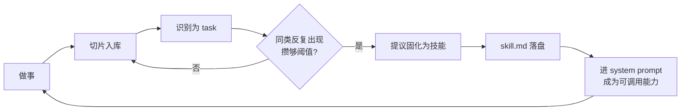

# Alear030 记忆系统

**中文** · [English](memory.en.md)

← [返回 README](../../README.md) · [文档目录](../index.md)

这是 Alear030 投入最重的一块，也是它与「ReAct + 工具调用」类项目的主要区别。整条链路——切话题边界、算向量、分类、去重、提炼画像、生成跨会话时间线、语义召回——全部在这个仓库里实现，**不依赖任何外部向量数据库**。

本文讲机制。**为什么是这个样子**见 [记忆的想法&构思](../design/memory.md)；架构总览见 [架构文档](../ARCHITECTURE.md)，配置项见 [配置说明](../CONFIGURATION.md)。

> **本文所有技术断言都对着代码核对过。** 没核实的推测一律不写，已知的粗糙处在最后一节如实列出。

---

## 目录

- [先决条件：默认是关闭的](#先决条件默认是关闭的)
- [设计立场](#设计立场)
- [数据流全景](#数据流全景)
- [切片与摘要](#切片与摘要)
- [Memory 管线](#memory-管线)
- [用户画像](#用户画像)
- [跨会话时间线](#跨会话时间线)
- [自涌现：这条管线会长出东西](#自涌现这条管线会长出东西)
- [召回](#召回)
- [本地嵌入模型](#本地嵌入模型)
- [会话内压缩与记忆的边界](#会话内压缩与记忆的边界)
- [这套机制是怎么长出来的](#这套机制是怎么长出来的)
- [已知限制](#已知限制)

---

## 先决条件：默认是关闭的

`config.py` 里 `MEMORY_PIPELINE_ENABLED = False`。**保持默认值 clone 下来跑，本文描述的一切都不会发生。**

而且它关掉的不只是「入库」——`hook/hooks/after_round/memory_pipeline/hook.py` 的判空在 `session._session_slice()` **之前**：

```python
if memory is None or not memory.pipeline_enabled:
    return
# 下面才是切片 + 摘要
session._session_slice()
session._session_summary()
```

所以关闭时切片、摘要、分类、画像、时间线**一步都不跑**。想体验完整能力，把 `config.py` 的 `MEMORY_PIPELINE_ENABLED` 改成 `True`。

代价要心里有数：开启后每轮对话会额外产生若干次模型调用（至少一次切片，加上每个待摘要片各一次，再加分类与画像提取）。

---

## 设计立场

### 不是「搜文档」，是「唤起经历」

常见的 RAG 做法是把资料切块、灌进向量库、按问题检索。Alear030 检索的不是资料，是**它自己经历过的对话片段**——由 LLM 判断话题边界切出来的「一件事」，带主题、关键词和摘要。

所以它的最小单元不是「一段文本」，而是「一段有起止轮次坐标的经历」。

### 事实源与派生存储分层

| 层 | 文件 | 谁写 | 能否重建 |
|---|---|---|---|
| **事实源** | `session/session_detail/{id}.json` 里的 `session_messages` 与 `session_slice` | `Session` | 不能，这是会话本身 |
| **派生存储** | `memory_storage/memory_storages/` 下的 `slice_node` / `user` / `timeline` / `advanced_task_node` | Memory 管线 | 理论上可由事实源重跑得出 |

**派生层不反写事实源。** 分类结果、画像、时间线都只往 `memory_storage/` 写，不回头改 `session_detail`。

### 不依赖外部向量库

向量用本地中文 GTE 模型算，`struct.pack` 后 base64 编码，直接存进切片所在的那个 JSON。召回是全量线性扫描 + 余弦相似度。规模上限明摆着，但换来零外部依赖、零额外服务。

---

## 数据流全景

```text
用户/assistant 消息
  │ Session.session_message_insert() → session_detail/{id}.json 的 session_messages[]
  ▼
after_round · memory_pipeline（后台线程，串行）
  │
  ├─1 session._session_slice()
  │    锁内读快照 → 锁外跑 LLM 与 embedding → 锁内短写
  │    产出 session_slice[] 条目：
  │      worthy_summary / session_id / time_stamp / start_round / end_round
  │      slice_embedding(b64) / slice_anchor{topic, key_words, summary_detail:""}
  │
  ├─2 session._session_summary()
  │    挑 worthy_summary=True 且 summary_detail 为空的片 → 线程池(5) 并发摘要
  │    写回 summary_detail，并用 topic+key_words+summary_detail 重算 embedding
  │
  └─3 取 session_slice[:-1]（排除仍在生长的尾片）中 worthy_summary=True 的
       → Memory.slices_pipeline()
             ├ 锁外乐观去重（省 LLM 调用）
             ├ slices_type_define() 分类为 task / user_info
             ├ 锁内二次去重后写入 slice_node.json
             └ 对本次真正新入库的片：
                 'user_info' → user_info_extract() → user.json
                              → user_info_reform() → user_info.json 模板
                 'task'      → advanced_task_node_judge()
                              → (NO_MATCH) normal_task_node_judge()
                              → 够格的产出 skill 候选，经 attachment 提示主 agent

after_session · final_memory_pipeline
  └ 对此时已封口的最终尾片跑同一套 slices_pipeline

after_session · session_timeline
  └ Memory.session_timeline_extract() → timeline.json 追加一条

消费端
  ├ prompt/prompts/memory_prompt/    读 user.json     → 注入 main 的 system prompt
  ├ prompt/prompts/timeline_prompt/  读 timeline.json → 近/远分层后注入
  └ tool/tools/memory_recall/        主 agent 主动调用，检索历史 session_detail
```

各产物一句话对照：

| 产物 | 是什么 | 生产者 | 消费者 |
|---|---|---|---|
| `session_slice` | 一段有起止轮次的经历，带主题/关键词/摘要/向量 | `_session_slice` + `_session_summary` | Memory 管线、`memory_recall`、会话压缩 |
| `slice_embedding` | 该片的语义向量（base64） | 同上 | `memory_recall` |
| `slice_node` | 分类后的切片档案 | `slices_pipeline` | task 判定、画像提取的上游 |
| `user.json` | 用户画像全量 | `user_info_extract` | `memory_prompt` 分块 |
| `user_info.json` | 画像的维度模板（不含具体信息） | `user_info_reform` | 下次提取时作为 prompt 模板 |
| `timeline.json` | 每个会话一条的跨会话事件 | `session_timeline_extract` | `timeline_prompt` 分块 |

---

## 切片与摘要

### 重喂窗口：尾片是「未封口的临时尾巴」

切片不是「每来一轮封一片」。指针取**最后一片的 `start_round`**，把从那里到当前的所有消息重新喂给切片模型：

```python
slice_pointer = session_slice[-1]['start_round'] if session_slice else int(0)

unslice_messages = []
for msg in session_messages:
    if msg['message_round'] >= slice_pointer:
        unslice_messages.append(msg)
```

这样新来的轮次有机会**并进同一片**（同一件事在继续），而不是被强行切开。代价是最后一片每轮都要重算，所以它被称作「开口片」，只有被后续切片挤成非最后一片时才算定型。

窗口里**保留 `tool_calls` 与 `tool_result`**：工具调用是对话中真实发生的动作，是判断任务型片段边界的关键依据。但超长的 tool_result 正文会在此截断（`_slice_window_payload`），否则单条 174KB 的工具输出能把切片窗口顶到几万 token。

### 锚点偏移校正：不信任模型回显的轮次号

这是整个切片里最不显然的一处。模型经常把重喂窗口**当成一段从 1 开始的新对话**重新编号，导致 `start_round` 与真实轮次错位。

处理办法不是「校验不符就丢弃」（那样几乎切不出东西），而是取窗口内消息的真实最小 round 作锚点，用偏移量把整批拉回去：

```python
window_start = min(msg['message_round'] for msg in unslice_messages)
offset = window_start - parsed_slices[0]['start_round']
for s in parsed_slices:
    s['start_round'] += offset
    s['end_round'] += offset
```

模型守规矩输出绝对 round 时 `offset = 0` 原样通过；重新编号时偏移把它映射回真实坐标。**两种情况用同一段代码处理，不需要判断模型属于哪一类。**

归一化之后再校验无缝、无重叠、恰好覆盖整个窗口，不满足就整批放弃本轮（下一轮重喂窗口会把这些消息再带上），不写脏数据。

### 三段式锁

`_session_slice` 与 `_session_summary` 都是：**锁内读快照 → 锁外跑 LLM 和 embedding → 锁内短写**。

慢计算不能留在锁里，否则用户下一句输入的 `session_message_insert` 要等整轮切片跑完才能落盘，界面直接卡住。

代价是锁外那段时间盘上的数据可能已经变了，所以：

- 切片写回是**开口式**的——定型前缀必写；若盘上在前缀之后已经覆盖得比本次窗口更远，保留那段后续，不因尾片变更就整批丢弃
- 摘要写回是**按 `(start_round, end_round)` 坐标逐片合并**，不整表覆盖——否则会把锁外期间切片做的改动抹掉

### 摘要与向量的两次计算

| 时机 | 向量文本 | 说明 |
|---|---|---|
| 切片阶段 | `topic + key_words` | 每个新片都算 |
| 摘要之后 | `topic + key_words + summary_detail` | 覆盖上一步的值 |

只有 `worthy_summary=True` 的片会走第二步。判据在 `_session_slice_summary` 开头：

```python
if not session_slice['worthy_summary'] or session_slice['slice_anchor']['summary_detail']:
    return session_slice
```

**空摘要不落盘**：模型返回空内容时，连同那份按空摘要算出的 embedding 一起丢弃，留给下一轮重试。否则会用劣化向量覆盖切片阶段算出的可用向量。

---

## Memory 管线

入口是 `Memory.slices_pipeline()`。传进来的已经是 hook 预处理过的定型片（尾片排除在 hook 层做，`memory_core` 只接能直接处理的片）。

### 两层去重

去重键是 **`(session_id, start_round, end_round)` 坐标**，不是内容哈希——坐标本身就是切片的物理身份，同一会话同一轮次区间只可能被切一次。

分两层：

1. **锁外乐观去重**：读 `slice_node.json`，已存在的整片跳过，**连分类的 LLM 调用都省掉**。读是无锁的，可能读到过期数据，但这只影响「省不省算力」
2. **锁内二次去重**：正确性由这层兜底，防两个后台钩子并发时都判定同一片为新片而重复写入

`actually_new` 只记录锁内确认真正入库的片，后续的画像提取严格基于它，所以并发下也不会重复提取。

### 三态契约

task 判定走两级路由，靠三个哨兵值区分：

| 返回 | 含义 | 后续 |
|---|---|---|
| `JUDGE_MERGED` | 并进了已有节点 | 结束 |
| `JUDGE_NO_MATCH` | 高阶节点池里没匹配上 | 降级走 `normal_task_node_judge` |
| `JUDGE_FAILED` | 判定本身失败 | 放弃该 slice 的 task 处理，**不降级** |
| 其他（节点列表） | 够格建 skill 的节点 | 收集进 skill 候选 |

`FAILED` 与 `NO_MATCH` 必须分开——失败时降级重跑只是把错误再犯一遍。

### 单 agent 多档位

memory 侧只有 `memory_agent` 一个实例，靠 `_switch_prompt()` 换 system prompt、`refresh_agent_level()` 换模型档位来适配不同子任务（分类用 `medium_level`，画像提取用更强的档位），而不是为每种子任务各建一个 Agent。

代码注释写明了动机：避免过多 subagent 导致配置冗余。

> 这种「原地改共享状态」的线程安全，依赖 `HookManager` 的后台线程池 `max_workers=1`——所有后台 hook 严格串行。这是一条**隐式约定**，`Memory` 内部没有加锁体现。详见[已知限制](#已知限制)。

---

## 用户画像

### 两份文件，别搞混

| 文件 | 内容 | 谁写 |
|---|---|---|
| `memory_storage/memory_storages/user.json` | 画像**全量**，含具体信息与来源坐标 | `user_info_extract` 整份覆盖 |
| `memory_config/memory_configs/user_info.json` | 画像的**维度模板**，只有维度名/描述/特征词，不含具体信息 | `user_info_reform` 差量合并 |

模板文件的作用是下次提取时作为 prompt 里的维度参考，让画像维度能随使用自涌现，而不是写死一套固定字段。

### 「全量承载」式提取

与 `slice_node` 用坐标做结构化去重不同，画像的「印证 / 更新 / 剔除 / 维度合并」是语义判断，很难用固定字段规则表达。所以做法是：**让模型每次都输出「历史 + 本次」合并后的完整画像**，Python 侧直接整份覆盖落盘。

落盘前有两道校验：

1. **形状校验**——必须是非空 `list[dict]` 且每维带 `type_name`。模型偶发返回 `["系统错误"]` 或纯字符串时绝不能落盘，否则会污染 `user.json`，下次启动 `memory_prompt` 分块直接 `AttributeError`
2. **来源过滤**——`info_list` 里没有 `info_source` 的条目会被剔除。无来源即不可靠，符合「只提取有据可依的信息」原则

校验的是**形状与来源**，不是完整性。见[已知限制](#已知限制)。

---

## 跨会话时间线

`after_session` 时把本次会话全部 worthy slice 提炼成**一条**时间线事件，追加进 `timeline.json`：

```json
{ "session_id": "...", "thread": ["...", "..."], "summary": "...", "keywords": ["..."], "source": "llm" }
```

### 三级校验后才降级

不是解析失败就 fallback，而是逐级检查：

1. JSON 能不能解析
2. 形状是不是「仅含一个对象的数组」
3. `thread` / `summary` / `keywords` 三个字段逐个校验类型与非空

任何一级不过，走 `_fallback_timeline_entry()`：把各 slice 的 `summary_detail` 原样拼成 `thread`，`keywords` 取各片关键词去重，`summary` 留空，并标记 `source: "fallback"`。

**`source` 字段让降级条目可被识别**——事后想重跑或评估提炼质量时，能一眼分出哪些是模型产出、哪些是兜底拼接的。

### 近/远分层渲染

注入 system prompt 时不是全量拼进去（会话多了会撑爆）。`prompt/prompts/timeline_prompt/` 倒序渲染：近处若干条带完整 `thread`，更早的只保留 `keywords + summary`，并有 token 预算上限。

> 注意这套分层渲染**只存在于 prompt 层**，`memory_core` 里没有对应实现。`timeline_prompt/prompt.py` 的注释声称与 `memory_core` 保持一致，那是旧路径的遗留描述。

---

## 自涌现：这条管线会长出东西

前面几节讲的是「记住」。但**记住从来不是我的目标**——我要的是一个能自己生长的 agent，记忆只是实现它所必需的底座（这条主线的来历见[记忆的想法&构思](../design/memory.md)）。

这一节讲的就是那个目标落到机制层的样子：**这套管线的几张表都不是写死的 schema，而是随使用自己生长的。**

### 第一层：分类特征词自涌现

切片分类不是靠固定的关键词表。`memory_type.json` 里每个类型带一组 `type_feature` 特征词，每次分类时模型可以提出新特征，`_update_memory_type` 把没见过的追加进去：

```python
new_items = [f for f in type_feature if f not in existing]
merged = existing + new_items
entry['type_feature'] = type_feature if len(merged) > 10 else merged
```

超过 10 条时不是无限堆积，而是**采用模型给出的合并后全量结果整体替换**——模型按 prompt 规则已经算好了哪些该合并。特征库因此会收敛，而不是越长越臃肿。

### 第二层：画像维度自涌现

用户画像**没有预设字段表**。`user_info.json` 存的是维度模板（维度名 / 描述 / 特征词，不含具体信息），而这份模板由 `user_info_reform` 随每次提取演化，共四种情形：

| 情形 | 处理 |
|---|---|
| 维度全新 | 新增进模板 |
| 维度描述变了 | 覆盖描述 |
| 有新特征词 | 追加，去重保序 |
| **两个维度该合并** | 按 `merged_from` 精确删除被吸收的旧维度 |

最后一条是这里最需要解释的设计。合并**不靠「这次没出现就删掉」的推断**，而要求模型在合并后的维度上显式带一个 `merged_from` 列表，声明它吸收了哪些旧维度名。代码注释写明了理由：

> 靠 rq_json 里合并后维度自带的 merged_from（被吸收掉的旧 type_name 列表）精确删除，不靠"缺席即删"的猜测（避免误删还没攒到 info 的种子维度）

「缺席即删」会误杀**刚刚诞生、还没攒到任何具体信息的种子维度**——它这次没被提及只是因为还没有内容，不是因为该被合并掉。要求显式声明，新生维度就能安全地活到攒够内容为止。

于是画像的**分类体系本身**会生长、修正、收敛，而不只是往固定字段里填值。

### 第三层：技能自涌现 —— 记忆闭环回能力

这一层是前两层的延伸，也是整条管线的落点。

被分类为 `task` 的切片会去和已有的高阶任务节点做语义匹配。当同一类任务反复出现、来源攒到阈值，管线就产出一个 **skill 候选**，经 attachment 提示主 agent：「最近 N 次任务被识别为相似模式，建议固化为可复用技能」。

```python
if not skill_info and len(sources) >= 2:     # 新建节点时已至少带 2 来源,append 后达 3
    ...产出「创建技能」候选
elif skill_info and len(sources) >= 3:       # 已固化节点:清零后重新累积到 3
    ...产出「更新技能」候选
```

技能一旦被创建，`skill_info` 写回节点，`task_slices_nodes` **清零重新计数**——此后再匹配上的切片是「这个技能又被用了一次」的新变体证据，攒够 3 条才提议更新技能，而不是拿旧的累积值反复触发。

于是形成一个闭环：



**记忆在这里不只是被读取，它在生成能力。** 多数 agent 记忆系统止步于召回——存进去、查出来。这条管线多走了一步：它观察自己反复做过什么，然后提议长出一个新技能。技能固化之后进入 system prompt，成为下一轮可以直接调用的东西，产生的新切片又回流进同一条管线。

### 这意味着什么，以及还差什么

三层叠起来，系统的**分类方式、认识用户的角度、会做的事情**都不是一次性设计好的，而是随使用积累而变化的。这是它区别于「把对话存进向量库」的地方。

但也要说清现状的边界：

- 技能候选**只是提议**，最终由用户确认后才写盘（`skill_finish` 那条路径），不是自动创建
- 阈值（2 / 3）是写死的常量，没有随使用调整
- 三层自涌现之间没有互相反馈——比如画像里长出的新维度不会影响 task 的匹配策略
- 整条链路默认关闭，见[开头那节](#先决条件默认是关闭的)
- **最根本的一条：类型集合本身还是写死的。** 特征词、维度、技能都会长，但「一共有哪几类记忆」还是我定的——`slices_pipeline` 里只有 `user_info` 与 `task` 两个硬编码分支。把这个也解开才算是真的自涌现，那是主线的下一段，见[想法&构思那一篇](../design/memory.md#什么是自涌现现在是什么程度潜力或者我对他未来的期望是什么)

---

## 召回

`memory_recall` 工具，主 agent 主动调用。

### 检索源是原始 slice，不是 slice_node

```python
def _get_session_detail_ids():
    return sorted(f.stem for f in Path(SESSION_MEMORTY_DETAIL_PATH).glob("*.json"))[:-1]
```

读的是 `session/session_detail/*.json` 里的 `session_slice`，**不是** Memory 管线产出的 `slice_node.json`。

**这是现状，不是设计决策。** `tool.py` 顶部有我自己留的标记：

```python
#@claude 这里其实后续应该将搜索的节点转移到memory_storage中的slice_node文件中
```

当前这样做的实际效果是：召回不依赖管线是否跑过，即便 `MEMORY_PIPELINE_ENABLED=False` 也……并不能用——因为管线关闭时切片本身就不跑，没有 slice 也就没有向量。所以两者其实是绑定的。

`[:-1]` **排除当前 session**（依赖 session_id 是可排序的时间戳，最新的排在最后）。当前会话内的失忆问题由[会话内压缩](#会话内压缩与记忆的边界)那条路径解决。

### 检索过程

1. `key_words` 与 `search_target` 拼成查询文本，算向量
2. 线程池并发读各 session 文件，取出全部 slice
3. 逐个算余弦相似度，按 score 降序取 `top_k`
4. 返回 `session_id / topic / start_round / end_round / key_words / summary_detail / score`

**没有相似度下限**，只有 `top_k`。score 再低也会被返回，靠模型自己看 score 判断可信度。

### 三处不静默失败

- 嵌入模型没就绪时立刻返回 JSON 状态（`weights_loading` / `failed`），**不阻塞等待**
- 缺 `slice_embedding` 的历史片跳过，并在结果里报 `skipped_no_embedding` 计数
- 单个 session 文件损坏不毁掉整次召回，跳过并在 `failed_session_files` 里记名

召回结果变少时能看出原因，而不是静默返回一个短列表。

---

## 本地嵌入模型

中文 GTE 模型跑在**独立的 worker 进程**里，协议是 stdin/stdout 各一行一个 JSON（带 id 配对），日志与库噪音只走 stderr 以免污染协议。

独立进程的理由：模型加载慢（首次还要从 ModelScope 下载约 195MB 权重），放主进程会让 TUI 迟迟起不来；而且第三方库的噪音输出会糊掉 Textual 界面。

### 五态状态机

`idle → downloading → loading → ready`，任何一步出错转 `failed`。

关键在于 **`start` 命令立刻返回当前 phase，下载与加载丢给 boot 线程**——这样 stdin 始终能响应 `status` 查询，不会因为在下载权重就整个卡死。调用方据此决定是等待还是降级。

### 一个 Windows 特有的坑

worker 启动时强制把 `stdin` / `stdout` / `stderr` 三个流都设成 utf-8：

```python
# Windows 默认 stdin 常是 gbk：客户端按 utf-8 写中文会被读坏，tokenizer 直接炸
```

---

## 会话内压缩与记忆的边界

这两个子系统有一处必须一起看的耦合。

`memory_recall` **结构性地排除当前 session**。所以当会话 token 超限触发压缩、更早的原始消息被移出上下文后，那部分内容会变成「确实发生过，但哪儿都查不到」的黑洞。

`session_compress` 因此必须自己兜底：压缩时把除最后一片外的所有 slice 摘要经 `attachment` 注入，`message_list` 重置为 `system + 最后一片原始消息`。

```python
# 而 memory_recall 排除当前 session 救不回来，故必须经 attachment 自动注入
```

压缩前还会补跑一次 `_session_summary()`，防的是「后台管线还没来得及给这些片生成摘要」的时序缺口。

---

## 这套机制是怎么长出来的

上面写的是「现在是什么样」。**为什么是这个样子**——包括那个讨论最久却主动没有落地的图结构、Hook 系统其实源于一次切片卡顿、以及一个我自己测出来的反直觉结论——单独写在了 **[记忆的想法&构思](../design/memory.md)**。

那一篇也说清了一件本文没讲的事：**这套系统的目标不是记忆本身**。

---

## 已知限制

如实列出，都是根据具体的代码确认的。

**召回相关**

- **无相似度下限**。数据库越大、话题越冷门，返回的「最相关」结果实际可能毫不相关
- **召回池包含闲聊片段**。`_get_slice` 不过滤 `worthy_summary`，而 `worthy_summary=False` 的片其 `summary_detail` 恒为空、向量永远停留在「仅 topic+key_words」的初版，会稀释召回质量
- **`[:-1]` 排除当前 session 依赖文件名可排序**。session_id 是时间戳所以成立，但这是隐式约定而非显式判断

**入库相关**

- **分类失败的片会带着缺失的 `slice_type` 入库，且永不重试**——坐标已存在，去重逻辑会让它再也不被重新分类
- **画像提取只校验形状与来源，不校验完整性**。「全量承载」的正确性完全押在模型每次都老实带上历史条目；某次输出漏掉历史，历史画像就被整份覆盖式地永久丢失
- **`user.json` 的写入没有锁**。相邻的 `slice_node_updater` / `timeline_updater` 都是带锁的读改写，唯独它是裸覆盖写（代码里有我自己留的 `@claude(ignore)` 提醒）
- **task 候选池没有 token 预算分层**。每次 task 分类都把候选池全量拼进 prompt，长期运行会持续膨胀、变慢变贵

**并发相关**

- **`memory_agent` 的共享可变状态没有锁**，正确性依赖后台线程池 `max_workers=1` 这条隐式约定。若将来调大 worker 数，或新增别的并发触发路径，`_switch_prompt` 会在并发下相互踩踏——不报错，只是分类结果串味

**解析相关**

- 模型输出的 JSON 定位用的是「从末尾找最后一个完整数组」的启发式，依赖「真正答案在文本最后」这一输出习惯。模型某次先给结果、后面又追加带示例数组的解释文字时会取错

---

← [返回 README](../../README.md) · [架构文档](../ARCHITECTURE.md) · [配置说明](../CONFIGURATION.md)
